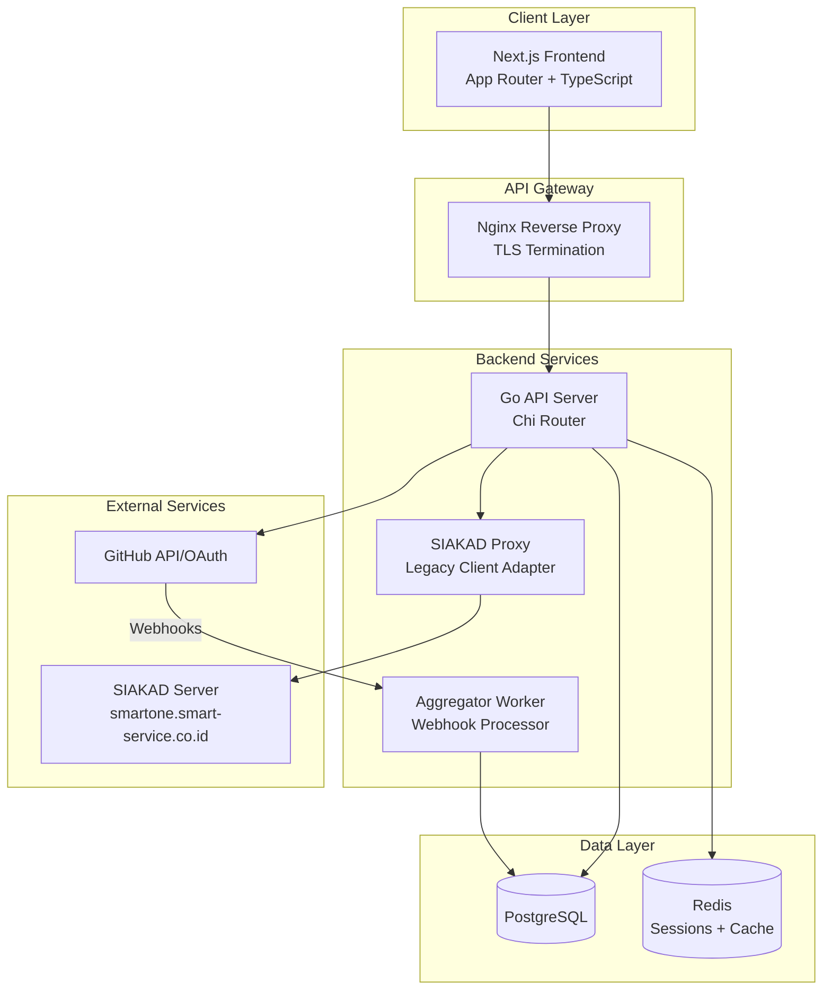
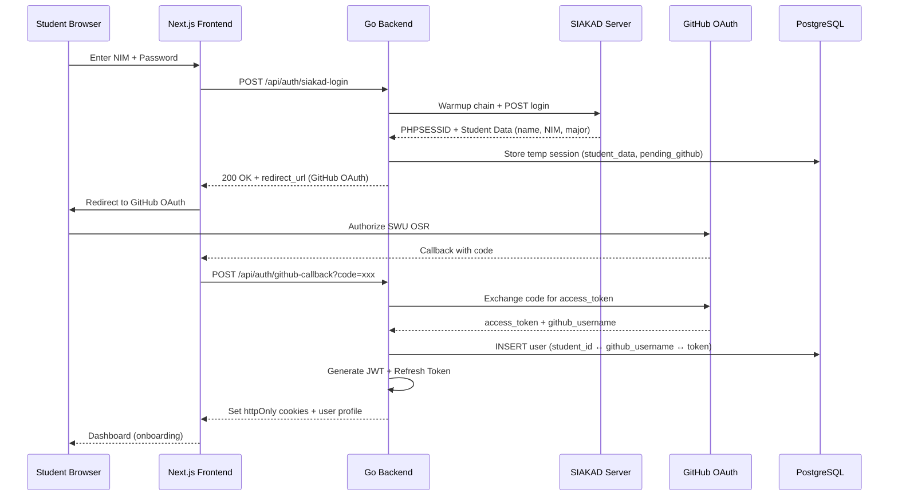
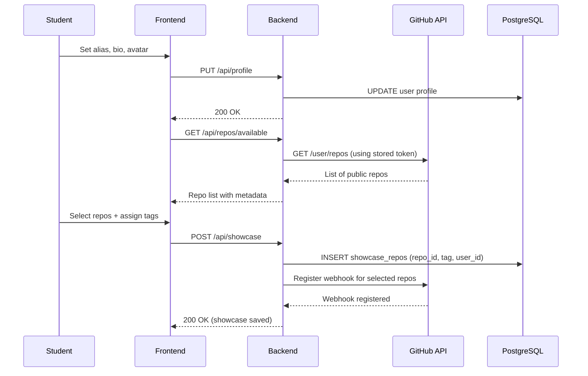
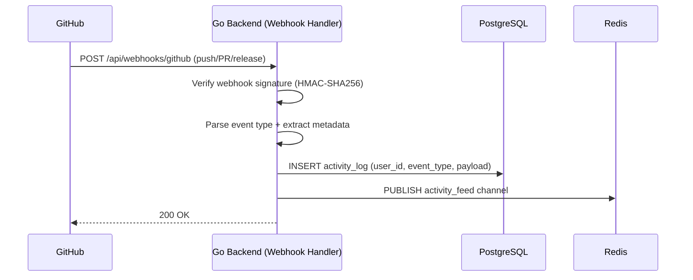
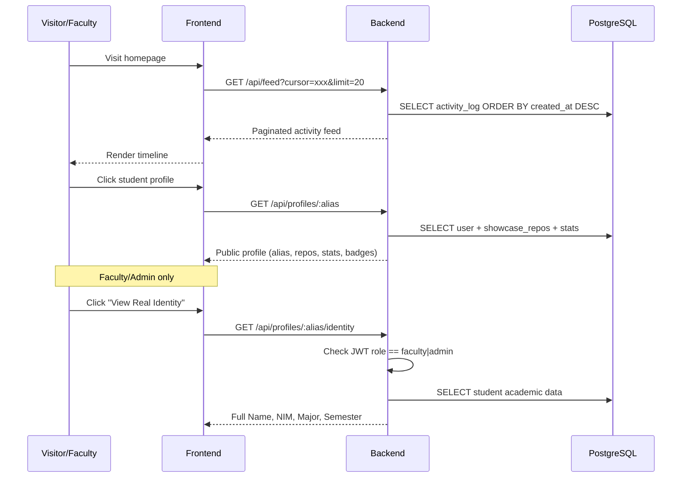
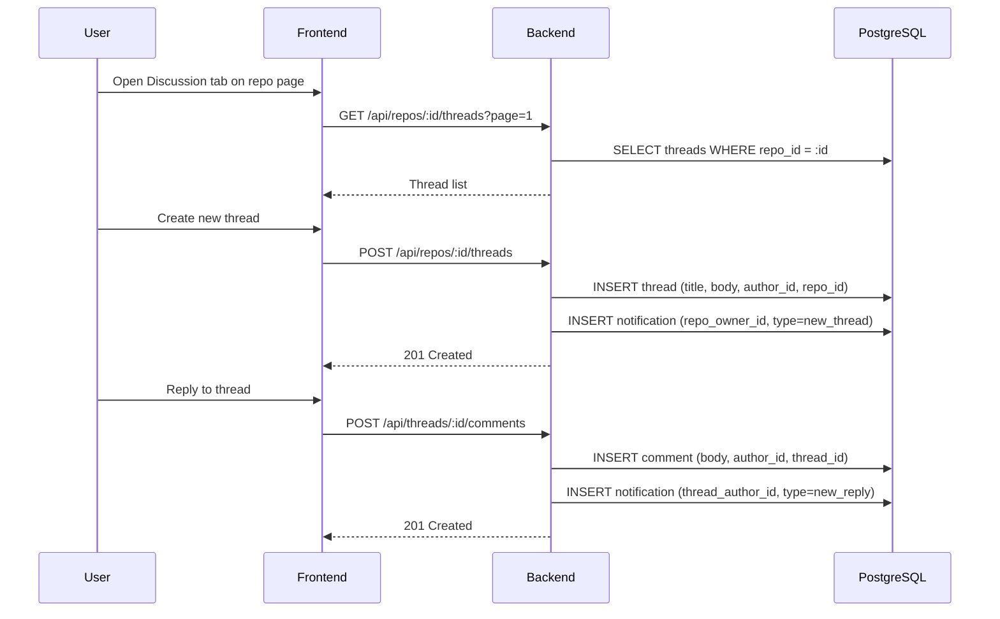

# Design Document: SWU OSR Platform

## Overview

SWU OSR (Open Source Repository) is a campus open-source repository platform for SWU (Sains dan Teknologi Walisongo) university in Purwokerto. Built as an HMPSTI project to establish SWU as a technology hub, the platform links student academic identities (from SIAKAD) with their GitHub accounts, aggregates their GitHub activity via webhooks, and displays it on a public dashboard with pseudonym-first culture.

The system operates in five phases: (1) Authentication & Identity Binding via SIAKAD proxy + GitHub OAuth, (2) Onboarding & Showcase Selection where students curate their public repos, (3) Aggregator Engine that captures GitHub webhooks in real-time, (4) Public Home & Identity Validation with role-based access to real identities, and (5) Internal Discussion Forum for campus-scoped collaboration.

The backend is a Go monolith using Chi router with Clean Architecture (Handler → Service → Repository → PostgreSQL). The frontend is a Next.js App Router application with TypeScript, Tailwind CSS, and shadcn/ui. The existing SWAAP legacy client is adapted for SIAKAD proxy authentication.

## Architecture



### Project Structure

```
swu-osr/
├── backend/
│   ├── cmd/api/main.go
│   ├── internal/
│   │   ├── config/          # Environment-based config
│   │   ├── domain/          # Business entities & interfaces
│   │   ├── handler/         # HTTP handlers (thin layer)
│   │   ├── service/         # Business logic
│   │   ├── repository/      # DB queries (sqlc-generated)
│   │   ├── middleware/      # Auth, logging, CORS, rate-limit
│   │   ├── siakad/          # SIAKAD proxy (adapted from SWAAP legacy)
│   │   └── github/          # GitHub OAuth + API client
│   ├── migrations/          # golang-migrate SQL files
│   ├── sqlc/                # sqlc queries & config
│   ├── Dockerfile
│   └── go.mod
├── frontend/
│   ├── src/
│   │   ├── app/             # App Router pages & layouts
│   │   ├── components/      # Reusable UI (shadcn/ui)
│   │   ├── features/        # Feature modules
│   │   ├── hooks/           # Custom React hooks
│   │   ├── lib/             # API client, utils
│   │   └── types/           # TypeScript definitions
│   ├── Dockerfile
│   └── package.json
├── docker-compose.yml
├── docker-compose.prod.yml
└── nginx/nginx.conf
```

## Sequence Diagrams

### Phase 01: Authentication & Identity Binding



### Phase 02: Onboarding & Showcase Selection



### Phase 03: Aggregator Engine



### Phase 04: Public Dashboard & Identity Validation



### Phase 05: Internal Discussion Forum



## Components and Interfaces

### Component 1: SIAKAD Proxy (adapted from SWAAP legacy)

**Purpose**: Authenticates students against the campus SIAKAD server by simulating browser sessions. Adapted from the existing `legacy.Client` in SWAAP.

**Interface**:
```go
// internal/siakad/siakad.go
type Service interface {
    // Authenticate performs the full SIAKAD login flow:
    // warmup chain → POST credentials → extract PHPSESSID → retrieve student data
    Authenticate(ctx context.Context, nim, password string) (*StudentData, error)
}

type StudentData struct {
    NIM       string `json:"nim"`
    FullName  string `json:"full_name"`
    Major     string `json:"major"`
    Semester  int    `json:"semester"`
    IsActive  bool   `json:"is_active"`
    SessionID string `json:"-"` // PHPSESSID, not exposed to client
}
```

**Responsibilities**:
- Execute warmup chain to initialize PHP session
- POST credentials to SIAKAD login endpoint
- Extract PHPSESSID from response
- Retrieve student academic data from authenticated session
- Never store student credentials

### Component 2: GitHub OAuth & API Client

**Purpose**: Handles GitHub OAuth flow and provides authenticated access to GitHub API for repo listing and webhook management.

**Interface**:
```go
// internal/github/github.go
type Service interface {
    GetAuthorizationURL(state string) string
    ExchangeCode(ctx context.Context, code string) (*OAuthToken, error)
    GetUser(ctx context.Context, token string) (*GitHubUser, error)
    ListRepos(ctx context.Context, token string) ([]Repository, error)
    RegisterWebhook(ctx context.Context, token, owner, repo, webhookURL, secret string) error
    RemoveWebhook(ctx context.Context, token, owner, repo string, hookID int64) error
}

type OAuthToken struct {
    AccessToken  string `json:"access_token"`
    TokenType    string `json:"token_type"`
    Scope        string `json:"scope"`
}

type GitHubUser struct {
    ID        int64  `json:"id"`
    Login     string `json:"login"`
    AvatarURL string `json:"avatar_url"`
}

type Repository struct {
    ID          int64    `json:"id"`
    Name        string   `json:"name"`
    FullName    string   `json:"full_name"`
    Description string   `json:"description"`
    HTMLURL     string   `json:"html_url"`
    Language    string   `json:"language"`
    Languages   []string `json:"languages"`
    Stars       int      `json:"stars"`
    Forks       int      `json:"forks"`
    UpdatedAt   string   `json:"updated_at"`
}
```

### Component 3: Auth Service

**Purpose**: Orchestrates the two-step authentication (SIAKAD + GitHub), manages JWT tokens, and handles session lifecycle.

**Interface**:
```go
// internal/service/auth.go
type AuthService interface {
    // Step 1: Validate via SIAKAD, return pending session
    InitiateSIAKADLogin(ctx context.Context, nim, password string) (*PendingSession, error)
    // Step 2: Complete GitHub OAuth, bind identities, issue tokens
    CompleteGitHubOAuth(ctx context.Context, sessionID, code string) (*AuthResult, error)
    // Token management
    RefreshToken(ctx context.Context, refreshToken string) (*TokenPair, error)
    Logout(ctx context.Context, userID uuid.UUID) error
    // Admin fallback
    ManualVerify(ctx context.Context, adminID, studentID uuid.UUID, nim string) error
}

type PendingSession struct {
    SessionID   string      `json:"session_id"`
    RedirectURL string      `json:"redirect_url"`
    StudentData StudentData `json:"-"`
    ExpiresAt   time.Time   `json:"expires_at"`
}

type AuthResult struct {
    User         User      `json:"user"`
    AccessToken  string    `json:"access_token"`
    RefreshToken string    `json:"-"` // set in httpOnly cookie
}

type TokenPair struct {
    AccessToken  string `json:"access_token"`
    RefreshToken string `json:"-"`
}
```

**Responsibilities**:
- Coordinate SIAKAD login → GitHub OAuth flow
- Generate short-lived JWT (15min) + refresh tokens
- Store refresh tokens in Redis with user binding
- Enforce RBAC roles: student, faculty, admin
- Handle admin manual verification fallback

### Component 4: Showcase Service

**Purpose**: Manages student repository showcase selection, academic tagging, and GitHub webhook registration.

**Interface**:
```go
// internal/service/showcase.go
type ShowcaseService interface {
    GetAvailableRepos(ctx context.Context, userID uuid.UUID) ([]Repository, error)
    SetShowcase(ctx context.Context, userID uuid.UUID, selections []ShowcaseSelection) error
    GetShowcase(ctx context.Context, userID uuid.UUID) ([]ShowcaseRepo, error)
    UpdateShowcase(ctx context.Context, userID uuid.UUID, selections []ShowcaseSelection) error
    RemoveFromShowcase(ctx context.Context, userID uuid.UUID, repoID int64) error
}

type ShowcaseSelection struct {
    RepoID      int64       `json:"repo_id"`
    RepoName    string      `json:"repo_name"`
    FullName    string      `json:"full_name"`
    Tag         AcademicTag `json:"tag"`
}

type AcademicTag string

const (
    TagCoursework       AcademicTag = "coursework"
    TagThesis           AcademicTag = "thesis"
    TagHackathon        AcademicTag = "hackathon"
    TagPersonalResearch AcademicTag = "personal_research"
    TagTeamProject      AcademicTag = "team_project"
)
```

### Component 5: Aggregator Service

**Purpose**: Processes incoming GitHub webhooks, validates signatures, parses events, and stores activity logs.

**Interface**:
```go
// internal/service/aggregator.go
type AggregatorService interface {
    ProcessWebhook(ctx context.Context, payload []byte, signature, eventType string) error
    GetActivityFeed(ctx context.Context, params FeedParams) (*FeedResult, error)
    GetUserActivity(ctx context.Context, userID uuid.UUID, params FeedParams) (*FeedResult, error)
}

type FeedParams struct {
    Cursor string `json:"cursor"`
    Limit  int    `json:"limit"`
}

type FeedResult struct {
    Items      []ActivityItem `json:"items"`
    NextCursor string         `json:"next_cursor"`
    HasMore    bool           `json:"has_more"`
}

type ActivityItem struct {
    ID          uuid.UUID   `json:"id"`
    UserID      uuid.UUID   `json:"user_id"`
    UserAlias   string      `json:"user_alias"`
    AvatarURL   string      `json:"avatar_url"`
    EventType   EventType   `json:"event_type"`
    RepoName    string      `json:"repo_name"`
    Summary     string      `json:"summary"`
    Metadata    interface{} `json:"metadata"`
    CreatedAt   time.Time   `json:"created_at"`
}

type EventType string

const (
    EventPush    EventType = "push"
    EventPR      EventType = "pull_request"
    EventRelease EventType = "release"
)
```

### Component 6: Profile Service

**Purpose**: Manages public profiles, statistics, and role-gated identity access.

**Interface**:
```go
// internal/service/profile.go
type ProfileService interface {
    GetPublicProfile(ctx context.Context, alias string) (*PublicProfile, error)
    UpdateProfile(ctx context.Context, userID uuid.UUID, input ProfileInput) error
    GetRealIdentity(ctx context.Context, requesterID uuid.UUID, alias string) (*AcademicIdentity, error)
    GetUserStats(ctx context.Context, userID uuid.UUID) (*UserStats, error)
}

type PublicProfile struct {
    Alias       string         `json:"alias"`
    Bio         string         `json:"bio"`
    AvatarURL   string         `json:"avatar_url"`
    Repos       []ShowcaseRepo `json:"repos"`
    Stats       UserStats      `json:"stats"`
    Badges      []Badge        `json:"badges"`
    JoinedAt    time.Time      `json:"joined_at"`
}

type AcademicIdentity struct {
    FullName string `json:"full_name"`
    NIM      string `json:"nim"`
    Major    string `json:"major"`
    Semester int    `json:"semester"`
}

type UserStats struct {
    TotalCommits  int            `json:"total_commits"`
    TotalRepos    int            `json:"total_repos"`
    Languages     map[string]int `json:"languages"`
    ActiveDays    int            `json:"active_days"`
    CurrentStreak int            `json:"current_streak"`
}
```

### Component 7: Forum Service

**Purpose**: Manages discussion threads, comments, and internal notifications.

**Interface**:
```go
// internal/service/forum.go
type ForumService interface {
    ListThreads(ctx context.Context, repoID uuid.UUID, params PaginationParams) (*ThreadList, error)
    CreateThread(ctx context.Context, input CreateThreadInput) (*Thread, error)
    GetThread(ctx context.Context, threadID uuid.UUID) (*ThreadDetail, error)
    CreateComment(ctx context.Context, input CreateCommentInput) (*Comment, error)
    ListNotifications(ctx context.Context, userID uuid.UUID) ([]Notification, error)
    MarkNotificationRead(ctx context.Context, userID, notifID uuid.UUID) error
}

type CreateThreadInput struct {
    RepoID   uuid.UUID `json:"repo_id"`
    AuthorID uuid.UUID `json:"author_id"`
    Title    string    `json:"title"`
    Body     string    `json:"body"`
}

type CreateCommentInput struct {
    ThreadID uuid.UUID  `json:"thread_id"`
    AuthorID uuid.UUID  `json:"author_id"`
    ParentID *uuid.UUID `json:"parent_id"` // nil for top-level, set for replies
    Body     string     `json:"body"`
}
```

## Data Models

### Core Tables (PostgreSQL)

```sql
-- Users: the central identity binding table
CREATE TABLE users (
    id              UUID PRIMARY KEY DEFAULT gen_random_uuid(),
    nim             VARCHAR(20) UNIQUE NOT NULL,
    full_name       VARCHAR(255) NOT NULL,
    major           VARCHAR(255) NOT NULL,
    semester        INT NOT NULL,
    alias           VARCHAR(50) UNIQUE NOT NULL,
    bio             TEXT DEFAULT '',
    avatar_url      VARCHAR(512) DEFAULT '',
    github_username VARCHAR(100) UNIQUE NOT NULL,
    github_id       BIGINT UNIQUE NOT NULL,
    github_token    TEXT NOT NULL,  -- encrypted at rest
    role            VARCHAR(20) NOT NULL DEFAULT 'student',
    is_active       BOOLEAN NOT NULL DEFAULT true,
    created_at      TIMESTAMPTZ NOT NULL DEFAULT NOW(),
    updated_at      TIMESTAMPTZ NOT NULL DEFAULT NOW(),
    deleted_at      TIMESTAMPTZ
);

CREATE INDEX idx_users_alias ON users(alias) WHERE deleted_at IS NULL;
CREATE INDEX idx_users_github_username ON users(github_username) WHERE deleted_at IS NULL;
CREATE INDEX idx_users_role ON users(role) WHERE deleted_at IS NULL;

-- Showcase repositories
CREATE TABLE showcase_repos (
    id              UUID PRIMARY KEY DEFAULT gen_random_uuid(),
    user_id         UUID NOT NULL REFERENCES users(id),
    github_repo_id  BIGINT NOT NULL,
    repo_name       VARCHAR(255) NOT NULL,
    repo_full_name  VARCHAR(512) NOT NULL,
    description     TEXT DEFAULT '',
    language        VARCHAR(50) DEFAULT '',
    html_url        VARCHAR(512) NOT NULL,
    academic_tag    VARCHAR(50) NOT NULL,
    webhook_id      BIGINT,
    created_at      TIMESTAMPTZ NOT NULL DEFAULT NOW(),
    updated_at      TIMESTAMPTZ NOT NULL DEFAULT NOW(),
    deleted_at      TIMESTAMPTZ,
    UNIQUE(user_id, github_repo_id)
);

CREATE INDEX idx_showcase_repos_user ON showcase_repos(user_id) WHERE deleted_at IS NULL;
CREATE INDEX idx_showcase_repos_tag ON showcase_repos(academic_tag) WHERE deleted_at IS NULL;

-- Activity log (webhook events)
CREATE TABLE activity_logs (
    id              UUID PRIMARY KEY DEFAULT gen_random_uuid(),
    user_id         UUID NOT NULL REFERENCES users(id),
    showcase_repo_id UUID NOT NULL REFERENCES showcase_repos(id),
    event_type      VARCHAR(30) NOT NULL,  -- push, pull_request, release
    summary         TEXT NOT NULL,
    metadata        JSONB NOT NULL DEFAULT '{}',
    github_event_id VARCHAR(100),
    created_at      TIMESTAMPTZ NOT NULL DEFAULT NOW()
);

CREATE INDEX idx_activity_logs_created ON activity_logs(created_at DESC);
CREATE INDEX idx_activity_logs_user ON activity_logs(user_id, created_at DESC);
CREATE INDEX idx_activity_logs_event_type ON activity_logs(event_type);

-- Forum threads
CREATE TABLE threads (
    id              UUID PRIMARY KEY DEFAULT gen_random_uuid(),
    showcase_repo_id UUID NOT NULL REFERENCES showcase_repos(id),
    author_id       UUID NOT NULL REFERENCES users(id),
    title           VARCHAR(255) NOT NULL,
    body            TEXT NOT NULL,
    comment_count   INT NOT NULL DEFAULT 0,
    created_at      TIMESTAMPTZ NOT NULL DEFAULT NOW(),
    updated_at      TIMESTAMPTZ NOT NULL DEFAULT NOW(),
    deleted_at      TIMESTAMPTZ
);

CREATE INDEX idx_threads_repo ON threads(showcase_repo_id, created_at DESC) WHERE deleted_at IS NULL;

-- Forum comments (flat replies via parent_id)
CREATE TABLE comments (
    id              UUID PRIMARY KEY DEFAULT gen_random_uuid(),
    thread_id       UUID NOT NULL REFERENCES threads(id),
    author_id       UUID NOT NULL REFERENCES users(id),
    parent_id       UUID REFERENCES comments(id),  -- NULL = top-level comment
    body            TEXT NOT NULL,
    created_at      TIMESTAMPTZ NOT NULL DEFAULT NOW(),
    updated_at      TIMESTAMPTZ NOT NULL DEFAULT NOW(),
    deleted_at      TIMESTAMPTZ
);

CREATE INDEX idx_comments_thread ON comments(thread_id, created_at ASC) WHERE deleted_at IS NULL;

-- Internal notifications
CREATE TABLE notifications (
    id              UUID PRIMARY KEY DEFAULT gen_random_uuid(),
    user_id         UUID NOT NULL REFERENCES users(id),
    type            VARCHAR(50) NOT NULL,  -- new_thread, new_reply, new_comment
    reference_id    UUID NOT NULL,         -- thread_id or comment_id
    message         TEXT NOT NULL,
    is_read         BOOLEAN NOT NULL DEFAULT false,
    created_at      TIMESTAMPTZ NOT NULL DEFAULT NOW()
);

CREATE INDEX idx_notifications_user ON notifications(user_id, is_read, created_at DESC);

-- Refresh tokens
CREATE TABLE refresh_tokens (
    id              UUID PRIMARY KEY DEFAULT gen_random_uuid(),
    user_id         UUID NOT NULL REFERENCES users(id),
    token_hash      VARCHAR(128) NOT NULL UNIQUE,
    expires_at      TIMESTAMPTZ NOT NULL,
    created_at      TIMESTAMPTZ NOT NULL DEFAULT NOW(),
    revoked_at      TIMESTAMPTZ
);

CREATE INDEX idx_refresh_tokens_user ON refresh_tokens(user_id) WHERE revoked_at IS NULL;
```

**Validation Rules**:
- `users.alias`: 3-50 chars, alphanumeric + underscores, unique
- `users.role`: enum of `student`, `faculty`, `admin`
- `showcase_repos.academic_tag`: enum of `coursework`, `thesis`, `hackathon`, `personal_research`, `team_project`
- `activity_logs.event_type`: enum of `push`, `pull_request`, `release`
- `threads.title`: 5-255 chars, non-empty
- `threads.body` / `comments.body`: 1-10000 chars
- `notifications.type`: enum of `new_thread`, `new_reply`, `new_comment`

### Domain Types (Go)

```go
// internal/domain/user.go
type User struct {
    ID             uuid.UUID  `json:"id"`
    NIM            string     `json:"nim"`
    FullName       string     `json:"-"`  // hidden from public
    Major          string     `json:"-"`
    Semester       int        `json:"-"`
    Alias          string     `json:"alias"`
    Bio            string     `json:"bio"`
    AvatarURL      string     `json:"avatar_url"`
    GitHubUsername string     `json:"github_username"`
    GitHubID       int64      `json:"-"`
    Role           Role       `json:"role"`
    IsActive       bool       `json:"-"`
    CreatedAt      time.Time  `json:"created_at"`
    UpdatedAt      time.Time  `json:"updated_at"`
}

type Role string

const (
    RoleStudent Role = "student"
    RoleFaculty Role = "faculty"
    RoleAdmin   Role = "admin"
)

// internal/domain/showcase.go
type ShowcaseRepo struct {
    ID            uuid.UUID   `json:"id"`
    UserID        uuid.UUID   `json:"user_id"`
    GitHubRepoID  int64       `json:"github_repo_id"`
    RepoName      string      `json:"repo_name"`
    RepoFullName  string      `json:"repo_full_name"`
    Description   string      `json:"description"`
    Language      string      `json:"language"`
    HTMLURL       string      `json:"html_url"`
    AcademicTag   AcademicTag `json:"academic_tag"`
    WebhookID     *int64      `json:"-"`
    CreatedAt     time.Time   `json:"created_at"`
}
```

## Algorithmic Pseudocode

### Algorithm 1: SIAKAD Authentication Flow

```go
// Adapted from SWAAP legacy/client.go
// This reuses the warmup chain + login POST pattern from the existing codebase.

func (s *siakadService) Authenticate(ctx context.Context, nim, password string) (*StudentData, error) {
    // PRECONDITION: nim != "" && password != ""
    // POSTCONDITION: returns StudentData if SIAKAD validates credentials
    //                returns error if credentials invalid or SIAKAD unreachable

    // Step 1: Create HTTP client with cookie jar (simulates browser)
    client := newHTTPClientWithCookieJar(timeout: 30s)

    // Step 2: Execute warmup chain to initialize PHP session
    warmupChain := []string{
        "/swu.php",
        "/my_school.php?ada=2&sof=0&ol=0&hp=1&template=0",
        "/my_school_ok.php?benarinput=0&ada=2&sof=0&ol=0&hp=1&template=0",
        "/my_school_run.php?ada=2&sof=0&ol=0&hp=1&template=0",
        "/smart_school_biasa_2019.php",
    }
    for _, path := range warmupChain {
        _ = client.GET(baseURL + path)  // populates $_SESSION on server
    }

    // INVARIANT: After warmup, cookie jar contains valid PHPSESSID
    phpsessid := client.GetCookie("PHPSESSID")
    if phpsessid == "" {
        return nil, ErrSessionInitFailed
    }

    // Step 3: POST login credentials
    resp := client.POST(baseURL + "/login_proses.php", form{
        "username": nim,
        "password": password,
        "mac_addr": "",
    })

    // Step 4: Validate response
    if contains(resp.Body, "tidakterdaftar") {
        return nil, ErrInvalidCredentials
    }
    if contains(resp.Body, "salahdevice") {
        return nil, ErrDeviceRejected
    }

    // Step 5: Extract student data from authenticated session
    studentData := parseStudentDataFromSession(client, phpsessid)

    // POSTCONDITION: studentData.NIM == nim && studentData.IsActive == true
    return studentData, nil
}
```

### Algorithm 2: GitHub Webhook Processing

```go
func (a *aggregatorService) ProcessWebhook(ctx context.Context, payload []byte, signature, eventType string) error {
    // PRECONDITION: payload is raw HTTP body, signature is X-Hub-Signature-256 header
    // POSTCONDITION: activity_log entry created if valid, error if invalid signature or unknown repo

    // Step 1: Verify HMAC-SHA256 signature
    expectedMAC := computeHMAC(payload, webhookSecret)
    if !hmac.Equal([]byte(signature), []byte("sha256=" + expectedMAC)) {
        return ErrInvalidSignature
    }

    // Step 2: Parse event payload based on type
    var repoFullName, userLogin, summary string
    var metadata map[string]interface{}

    switch eventType {
    case "push":
        event := parsePushEvent(payload)
        repoFullName = event.Repository.FullName
        userLogin = event.Pusher.Name
        commitCount := len(event.Commits)
        summary = fmt.Sprintf("pushed %d commit(s) to %s", commitCount, event.Ref)
        metadata = map[string]interface{}{
            "commits": event.Commits[:min(5, commitCount)],
            "ref":     event.Ref,
        }
    case "pull_request":
        event := parsePREvent(payload)
        repoFullName = event.Repository.FullName
        userLogin = event.PullRequest.User.Login
        summary = fmt.Sprintf("%s PR #%d: %s", event.Action, event.Number, event.PullRequest.Title)
        metadata = map[string]interface{}{
            "action": event.Action,
            "number": event.Number,
            "title":  event.PullRequest.Title,
        }
    case "release":
        event := parseReleaseEvent(payload)
        repoFullName = event.Repository.FullName
        userLogin = event.Release.Author.Login
        summary = fmt.Sprintf("released %s: %s", event.Release.TagName, event.Release.Name)
        metadata = map[string]interface{}{
            "tag":  event.Release.TagName,
            "name": event.Release.Name,
        }
    default:
        return nil // ignore unsupported events
    }

    // Step 3: Resolve user and repo from database
    user := repo.FindUserByGitHubUsername(ctx, userLogin)
    if user == nil {
        return nil // webhook from non-registered user, ignore
    }
    showcaseRepo := repo.FindShowcaseRepo(ctx, user.ID, repoFullName)
    if showcaseRepo == nil {
        return nil // repo not in showcase, ignore
    }

    // Step 4: Insert activity log
    // INVARIANT: no duplicate entries for same github_event_id
    return repo.InsertActivityLog(ctx, ActivityLog{
        UserID:         user.ID,
        ShowcaseRepoID: showcaseRepo.ID,
        EventType:      eventType,
        Summary:        summary,
        Metadata:       metadata,
        GitHubEventID:  extractDeliveryID(payload),
    })
}
```

### Algorithm 3: Identity Access Control

```go
func (p *profileService) GetRealIdentity(ctx context.Context, requesterID uuid.UUID, alias string) (*AcademicIdentity, error) {
    // PRECONDITION: requesterID is authenticated user, alias is valid profile alias
    // POSTCONDITION: returns identity ONLY if requester.role ∈ {faculty, admin}
    //               returns ErrForbidden otherwise

    // Step 1: Verify requester role
    requester, err := p.userRepo.GetByID(ctx, requesterID)
    if err != nil {
        return nil, ErrUserNotFound
    }

    // INVARIANT: only faculty and admin can view real identities
    if requester.Role != RoleFaculty && requester.Role != RoleAdmin {
        return nil, ErrForbidden
    }

    // Step 2: Fetch target user by alias
    target, err := p.userRepo.GetByAlias(ctx, alias)
    if err != nil {
        return nil, ErrProfileNotFound
    }

    // Step 3: Return academic identity
    // POSTCONDITION: returned data contains NIM, FullName, Major, Semester
    return &AcademicIdentity{
        FullName: target.FullName,
        NIM:      target.NIM,
        Major:    target.Major,
        Semester: target.Semester,
    }, nil
}
```

### Algorithm 4: Cursor-Based Feed Pagination

```go
func (a *aggregatorService) GetActivityFeed(ctx context.Context, params FeedParams) (*FeedResult, error) {
    // PRECONDITION: params.Limit > 0 && params.Limit <= 50
    // POSTCONDITION: returns at most params.Limit items, ordered by created_at DESC
    //               next_cursor is set if more items exist

    limit := clamp(params.Limit, 1, 50)

    // Decode cursor (base64-encoded timestamp)
    var cursorTime time.Time
    if params.Cursor != "" {
        cursorTime = decodeCursor(params.Cursor)
    }

    // Fetch limit+1 to determine if more pages exist
    items := repo.GetActivityFeed(ctx, cursorTime, limit+1)

    hasMore := len(items) > limit
    if hasMore {
        items = items[:limit]
    }

    var nextCursor string
    if hasMore && len(items) > 0 {
        nextCursor = encodeCursor(items[len(items)-1].CreatedAt)
    }

    // POSTCONDITION: len(result.Items) <= limit
    return &FeedResult{
        Items:      items,
        NextCursor: nextCursor,
        HasMore:    hasMore,
    }, nil
}
```

## Key Functions with Formal Specifications

### Function: AuthMiddleware

```go
func AuthMiddleware(jwtSecret []byte) func(http.Handler) http.Handler
```

**Preconditions:**
- `jwtSecret` is non-empty byte slice
- Request contains `Authorization: Bearer <token>` header OR `access_token` cookie

**Postconditions:**
- If token valid and not expired: request context contains `UserClaims{UserID, Role, Alias}`
- If token invalid/expired: responds with 401 Unauthorized, handler not called
- No database calls (stateless validation)

**Loop Invariants:** N/A

### Function: RegisterWebhook

```go
func (g *githubService) RegisterWebhook(ctx context.Context, token, owner, repo, webhookURL, secret string) error
```

**Preconditions:**
- `token` is valid GitHub access token with `admin:repo_hook` scope
- `owner/repo` exists and is accessible by token owner
- `webhookURL` is a valid HTTPS URL reachable from GitHub
- `secret` is non-empty string for HMAC verification

**Postconditions:**
- GitHub webhook created for push, pull_request, release events
- Returns webhook ID on success
- If webhook already exists for same URL: returns existing webhook ID (idempotent)
- If token lacks permissions: returns ErrInsufficientScope

**Loop Invariants:** N/A

### Function: SetShowcase

```go
func (s *showcaseService) SetShowcase(ctx context.Context, userID uuid.UUID, selections []ShowcaseSelection) error
```

**Preconditions:**
- `userID` exists in users table and is active
- `selections` is non-empty, max 20 items
- Each selection has valid `RepoID` (exists on user's GitHub) and valid `Tag`
- No duplicate `RepoID` in selections

**Postconditions:**
- All previous showcase_repos for user are soft-deleted
- New showcase_repos entries created for each selection
- Webhooks registered for newly added repos
- Webhooks removed for repos no longer in showcase
- Operation is atomic (all-or-nothing via transaction)

**Loop Invariants:**
- For each processed selection: webhook state matches showcase state

## Example Usage

### Backend: HTTP Handler Example

```go
// internal/handler/auth.go
func (h *AuthHandler) HandleSIAKADLogin(w http.ResponseWriter, r *http.Request) {
    var input struct {
        NIM      string `json:"nim" validate:"required,min=8,max=20"`
        Password string `json:"password" validate:"required,min=1"`
    }
    if err := json.NewDecoder(r.Body).Decode(&input); err != nil {
        respondError(w, http.StatusBadRequest, "invalid request body")
        return
    }
    if err := h.validator.Struct(input); err != nil {
        respondError(w, http.StatusBadRequest, "validation failed: "+err.Error())
        return
    }

    session, err := h.authService.InitiateSIAKADLogin(r.Context(), input.NIM, input.Password)
    if err != nil {
        switch {
        case errors.Is(err, domain.ErrInvalidCredentials):
            respondError(w, http.StatusUnauthorized, "invalid NIM or password")
        case errors.Is(err, domain.ErrSIAKADUnavailable):
            respondError(w, http.StatusServiceUnavailable, "SIAKAD server unavailable")
        default:
            respondError(w, http.StatusInternalServerError, "internal error")
        }
        return
    }

    respondJSON(w, http.StatusOK, map[string]interface{}{
        "session_id":   session.SessionID,
        "redirect_url": session.RedirectURL,
        "expires_at":   session.ExpiresAt,
    })
}
```

### Frontend: Auth Flow Example

```typescript
// src/features/auth/hooks/useAuth.ts
import { useMutation } from '@tanstack/react-query'
import { apiClient } from '@/lib/api'

interface SIAKADLoginInput {
  nim: string
  password: string
}

interface PendingSession {
  session_id: string
  redirect_url: string
  expires_at: string
}

export function useSIAKADLogin() {
  return useMutation({
    mutationFn: async (input: SIAKADLoginInput): Promise<PendingSession> => {
      const res = await apiClient.post('/api/auth/siakad-login', input)
      return res.data
    },
    onSuccess: (data) => {
      // Store session_id, redirect to GitHub OAuth
      sessionStorage.setItem('pending_session', data.session_id)
      window.location.href = data.redirect_url
    },
  })
}
```

### Frontend: Activity Feed Component

```typescript
// src/features/feed/components/ActivityFeed.tsx
'use client'

import { useInfiniteQuery } from '@tanstack/react-query'
import { apiClient } from '@/lib/api'
import { ActivityItem } from '@/types/activity'

interface FeedResponse {
  items: ActivityItem[]
  next_cursor: string
  has_more: boolean
}

export function ActivityFeed() {
  const { data, fetchNextPage, hasNextPage, isLoading } = useInfiniteQuery({
    queryKey: ['activity-feed'],
    queryFn: async ({ pageParam }) => {
      const res = await apiClient.get<FeedResponse>('/api/feed', {
        params: { cursor: pageParam, limit: 20 },
      })
      return res.data
    },
    initialPageParam: '',
    getNextPageParam: (lastPage) =>
      lastPage.has_more ? lastPage.next_cursor : undefined,
  })

  if (isLoading) return <FeedSkeleton />

  return (
    <div className="space-y-4">
      {data?.pages.flatMap((page) =>
        page.items.map((item) => (
          <ActivityCard key={item.id} item={item} />
        ))
      )}
      {hasNextPage && (
        <button onClick={() => fetchNextPage()}>Load more</button>
      )}
    </div>
  )
}
```

## Correctness Properties

*A property is a characteristic or behavior that should hold true across all valid executions of a system—essentially, a formal statement about what the system should do. Properties serve as the bridge between human-readable specifications and machine-verifiable correctness guarantees.*

### Property 1: Identity Binding Uniqueness

*For any* two users in the system, their NIM values, GitHub usernames, and aliases must all be distinct. No two users can share any of these three identity fields.

**Validates: Requirements 2.4, 4.2**

### Property 2: Identity Access Control

*For any* request to view real academic identity (full name, NIM, major, semester), the response contains academic data if and only if the requester has a faculty or admin role. For any student or unauthenticated requester, the system returns 403 Forbidden.

**Validates: Requirements 9.1, 9.2, 9.3**

### Property 3: Public Profile Privacy

*For any* public-facing API response (public profile, activity feed items), the response contains alias and avatar but never contains NIM, full name, major, or semester fields.

**Validates: Requirements 4.4, 8.3**

### Property 4: Webhook Signature Verification

*For any* incoming webhook payload, the Aggregator processes it if and only if HMAC-SHA256(payload, webhook_secret) equals the provided signature. For any payload with an invalid signature, no database write occurs.

**Validates: Requirements 6.1, 6.2**

### Property 5: Webhook Event Parsing Correctness

*For any* valid push event with N commits, the resulting activity log entry contains the correct commit count, branch reference, and min(N, 5) commit details in metadata. *For any* valid pull_request event, the log contains action, PR number, and title. *For any* valid release event, the log contains tag name and release name.

**Validates: Requirements 6.3, 6.4, 6.5**

### Property 6: Webhook Idempotency

*For any* valid webhook event processed N times (same github_event_id), exactly one activity_log entry exists in the database.

**Validates: Requirements 6.7**

### Property 7: Webhook Filtering

*For any* webhook received from a GitHub username not registered in the system, or for a repository not in any user's showcase, the system creates no activity log entry and returns 200.

**Validates: Requirements 6.6**

### Property 8: Feed Ordering

*For any* activity feed response containing multiple items, items[i].created_at > items[i+1].created_at (strictly descending chronological order).

**Validates: Requirements 7.1**

### Property 9: Pagination Completeness

*For any* static dataset of activity logs, iterating all pages via cursor-based pagination yields every entry exactly once with no duplicates and no gaps. The union of all pages equals the complete dataset.

**Validates: Requirements 7.3, 7.4**

### Property 10: Pagination Limit Clamping

*For any* requested limit value, the system clamps it to the range [1, 50]. Values below 1 become 1, values above 50 become 50.

**Validates: Requirements 7.2**

### Property 11: Token Lifecycle

*For any* issued JWT, it contains user_id, role, and alias claims with a 15-minute expiration. *For any* refresh token, after one successful exchange it becomes invalid for reuse. *For any* user logout, all associated refresh tokens are revoked.

**Validates: Requirements 3.1, 3.3, 3.4**

### Property 12: Invalid Token Rejection

*For any* request containing a malformed, tampered, or expired JWT, the system responds with 401 Unauthorized without invoking the downstream handler.

**Validates: Requirements 3.5**

### Property 13: Showcase Selection Validation

*For any* showcase submission, the system accepts it if and only if it contains 1-20 selections and each selection's academic tag is one of: coursework, thesis, hackathon, personal_research, or team_project. Submissions exceeding 20 or containing invalid tags are rejected.

**Validates: Requirements 5.2, 5.3**

### Property 14: Showcase Atomicity

*For any* showcase update operation, either all changes (DB writes + webhook registrations/removals) succeed, or none are persisted. Partial failures result in a complete rollback.

**Validates: Requirements 5.6**

### Property 15: Alias Validation

*For any* alias string, the system accepts it if and only if it is 3-50 characters long, composed of alphanumeric characters and underscores, and not already taken by another user.

**Validates: Requirements 4.2**

### Property 16: Profile Update Round-Trip

*For any* valid profile input (alias, bio, avatar_url), updating a user's profile and then reading it back returns the same values that were submitted.

**Validates: Requirements 4.3**

### Property 17: Forum Content Validation

*For any* thread creation, the system accepts it if and only if the title is 5-255 characters and the body is 1-10000 characters. *For any* comment creation, the system accepts it if and only if the body is 1-10000 characters.

**Validates: Requirements 10.1, 11.1**

### Property 18: Notification Targeting Precision

*For any* new thread created on a repository, a notification is created for the repository owner and no other user. *For any* comment posted on a thread, a notification is created for the thread author and no other user.

**Validates: Requirements 10.3, 11.3, 12.1**

### Property 19: Comment Count Consistency

*For any* thread with N non-deleted comments, the thread's comment_count field equals N.

**Validates: Requirements 11.2**

### Property 20: Token Encryption Round-Trip

*For any* GitHub access token, encrypting it with AES-256-GCM and then decrypting produces the original token value.

**Validates: Requirements 14.3**

### Property 21: Rate Limiting Enforcement

*For any* IP address sending more than 100 requests per minute, or any authenticated user sending more than 300 requests per minute, subsequent requests are rejected until the window resets.

**Validates: Requirements 14.4**

## Error Handling

### Error Scenario 1: SIAKAD Server Unavailable

**Condition**: SIAKAD server (smartone.smart-service.co.id) returns timeout or 5xx
**Response**: Return 503 to client with message "SIAKAD server temporarily unavailable"
**Recovery**: Admin can manually verify students via `ManualVerify` endpoint. Retry with exponential backoff (max 3 attempts) before returning error.

### Error Scenario 2: GitHub Token Expired/Revoked

**Condition**: GitHub API returns 401 when using stored access token
**Response**: Mark user's token as invalid in database, return 401 to client
**Recovery**: User must re-authorize via GitHub OAuth. Webhooks continue to work (they use app-level secret, not user token).

### Error Scenario 3: Webhook Delivery Failure

**Condition**: GitHub reports webhook delivery failed (server unreachable)
**Response**: GitHub retries automatically (up to 3 times with exponential backoff)
**Recovery**: If VPS was down, missed events are not retroactively fetched. Activity log may have gaps during downtime.

### Error Scenario 4: Duplicate Webhook Event

**Condition**: GitHub delivers same event twice (network retry)
**Response**: Check `github_event_id` uniqueness constraint before insert
**Recovery**: Silently ignore duplicate, return 200 to GitHub. No duplicate activity entries.

### Error Scenario 5: Invalid Academic Tag

**Condition**: Client sends showcase selection with invalid tag value
**Response**: Return 400 with validation error listing valid tags
**Recovery**: Client corrects input and retries.

## Testing Strategy

### Unit Testing Approach

| Layer | Tool | Focus |
|-------|------|-------|
| Service | `testing` + `testify` | Business logic with mocked repositories |
| Handler | `httptest` | Request parsing, response format, status codes |
| SIAKAD Proxy | `httptest` server | Simulated SIAKAD responses |
| GitHub Client | `httptest` server | Simulated GitHub API responses |

Key test cases:
- Auth flow: valid credentials → token pair issued
- Auth flow: invalid credentials → 401 with correct error
- Webhook: valid signature → activity logged
- Webhook: invalid signature → rejected, no DB write
- Identity access: student role → 403 forbidden
- Identity access: faculty role → academic data returned
- Feed pagination: cursor continuity across pages

### Property-Based Testing Approach

**Property Test Library**: `github.com/leanovate/gopter` (Go property-based testing)

Properties to test:
- Feed pagination: for any dataset size, iterating all pages yields complete dataset with no duplicates
- Webhook idempotency: processing same event N times results in exactly 1 activity_log entry
- Token validation: any token generated by the system passes validation; any modified token fails
- Alias uniqueness: concurrent user registrations never produce duplicate aliases

### Integration Testing Approach

Use `testcontainers-go` for PostgreSQL + Redis:
- Full auth flow: SIAKAD mock → GitHub mock → token issuance → protected endpoint access
- Webhook → activity_log → feed query pipeline
- Showcase CRUD with webhook registration verification
- Forum thread → comment → notification pipeline

## Performance Considerations

- **Activity Feed**: Cursor-based pagination (keyset) instead of OFFSET for consistent performance at scale. Index on `(created_at DESC)` supports this.
- **Redis Caching**: Cache hot-path queries (public profiles, feed first page) with 30s TTL. Invalidate on webhook receipt.
- **Connection Pooling**: Use `pgxpool` with `MaxConns = 25` (tuned to VPS resources).
- **Webhook Processing**: Synchronous processing is acceptable for MVP (seconds latency). If volume grows, move to background queue (Redis list + worker goroutine).
- **GitHub API Rate Limits**: Cache repo lists per user (5min TTL). Batch webhook registrations. Monitor X-RateLimit-Remaining header.
- **Database**: Partial indexes (WHERE deleted_at IS NULL) reduce index size. JSONB for activity metadata avoids schema migrations for new event types.

## Security Considerations

- **Credential Handling**: Student passwords are NEVER stored. They transit through the Go backend to SIAKAD and are immediately discarded after the HTTP response.
- **GitHub Token Encryption**: Stored tokens encrypted with AES-256-GCM at rest. Encryption key from environment variable, not in code.
- **Webhook Verification**: Every incoming webhook verified via HMAC-SHA256 before processing. Reject-first approach.
- **RBAC Enforcement**: Role checks at service layer (not handler). Middleware extracts claims, service enforces authorization.
- **JWT Security**: Short-lived (15min), signed with HS256. Refresh tokens are single-use, stored hashed in DB, bound to user.
- **CORS**: Allowlist specific frontend origin only. No wildcard in production.
- **Rate Limiting**: Per-IP (100 req/min) and per-user (300 req/min) via Redis sliding window.
- **Input Validation**: All inputs validated at handler layer using `go-playground/validator`. SQL injection prevented by sqlc parameterized queries.
- **Identity Privacy**: Academic data (NIM, full name, major) never exposed in public API responses. Only accessible via role-gated endpoint.

## Dependencies

### Backend (Go)

| Purpose | Library | Version |
|---------|---------|---------|
| Router | `go-chi/chi/v5` | v5.x |
| DB Driver | `jackc/pgx/v5` | v5.x |
| SQL Codegen | `sqlc-dev/sqlc` | v1.x |
| Migrations | `golang-migrate/migrate/v4` | v4.x |
| Validation | `go-playground/validator/v10` | v10.x |
| JWT | `golang-jwt/jwt/v5` | v5.x |
| Logger | `uber-go/zap` | v1.x |
| Redis | `redis/go-redis/v9` | v9.x |
| Config | `spf13/viper` | v1.x |
| Testing | `stretchr/testify` | v1.x |
| PBT | `leanovate/gopter` | latest |
| UUID | `google/uuid` | v1.x |
| Crypto | `golang.org/x/crypto` | latest |

### Frontend (Next.js)

| Purpose | Library |
|---------|---------|
| Framework | Next.js 14+ (App Router) |
| Language | TypeScript 5.x |
| Styling | Tailwind CSS 3.x |
| UI Components | shadcn/ui |
| Data Fetching | @tanstack/react-query v5 |
| Forms | react-hook-form + zod |
| HTTP Client | axios |
| Icons | lucide-react |

### Infrastructure

| Purpose | Tool |
|---------|------|
| Database | PostgreSQL 16 |
| Cache/Sessions | Redis 7 |
| Containerization | Docker + Docker Compose |
| Reverse Proxy | Nginx |
| CI/CD | GitHub Actions |
| VPS | Team-owned server |
